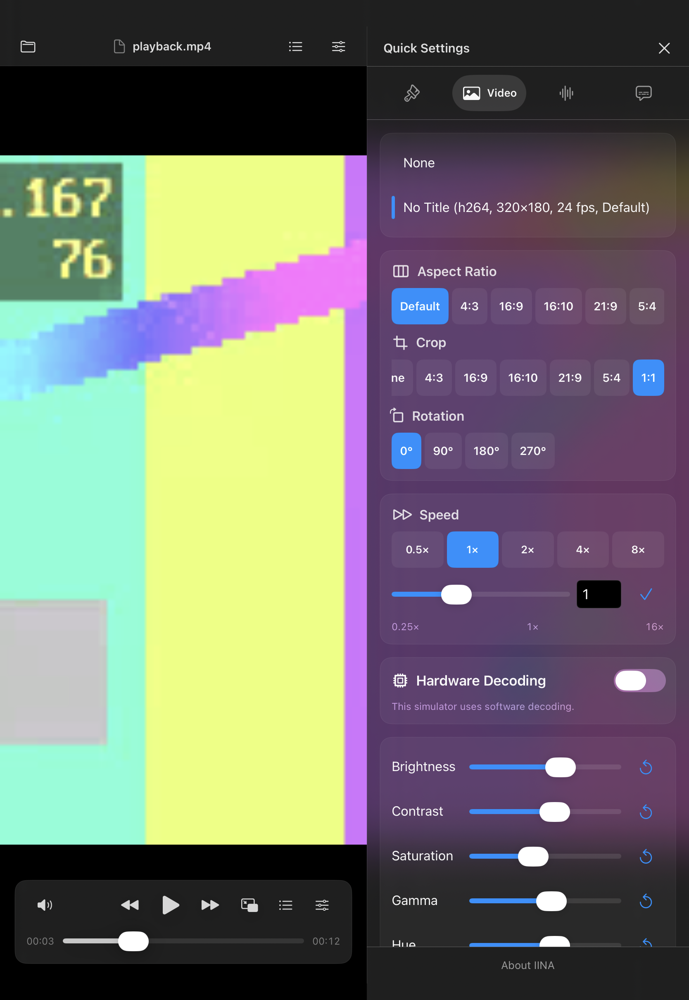
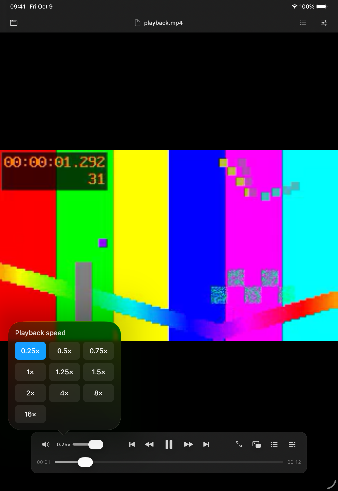
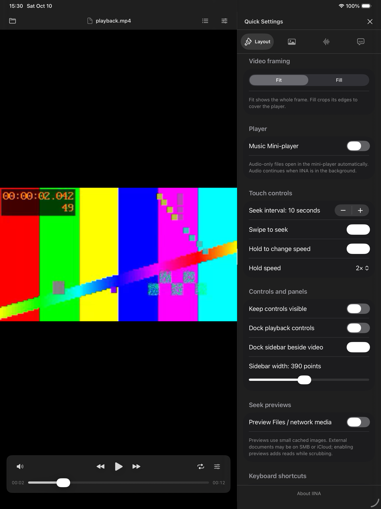
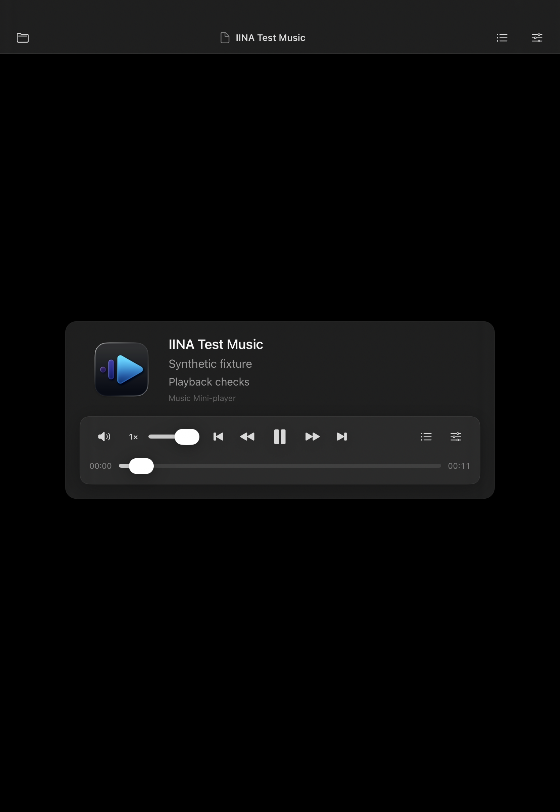
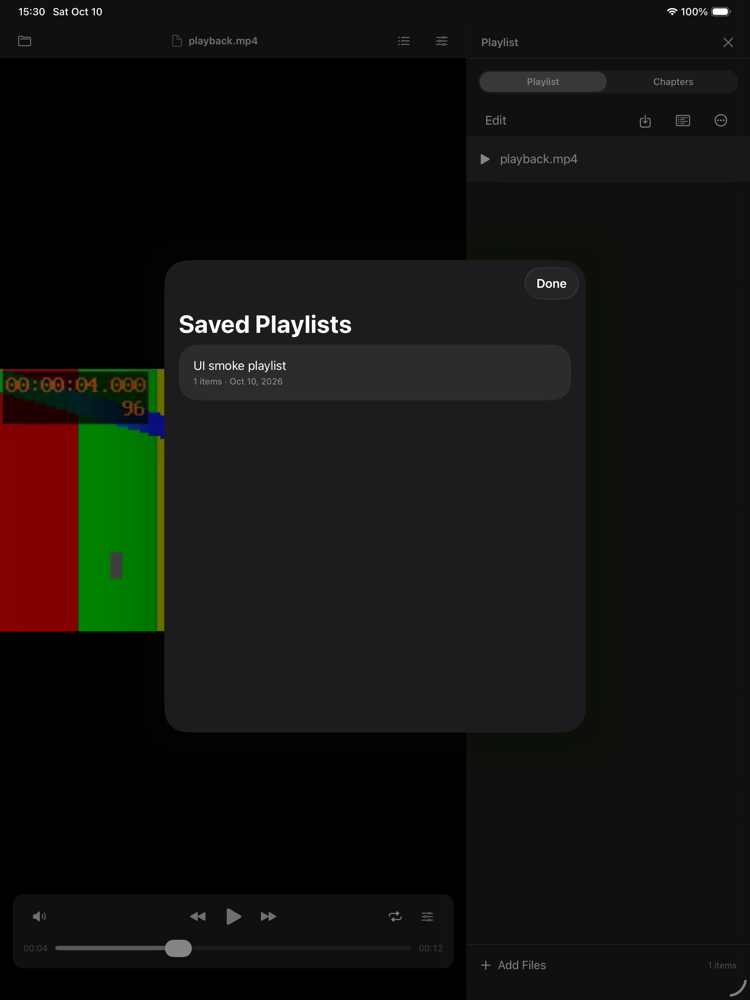
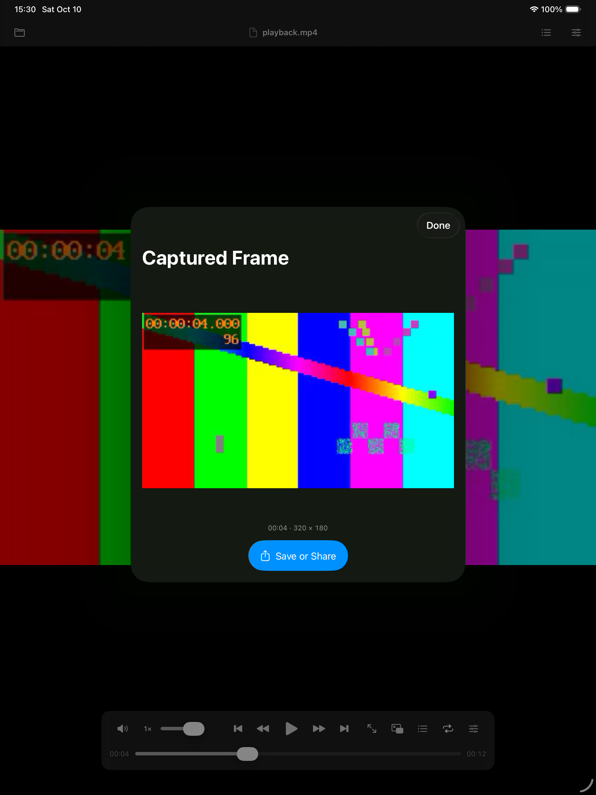

# IINA — experimental iPadOS contribution

This branch adds a separate SwiftUI/UIKit iPad application for consideration by the IINA project. It is an **unofficial, experimental contribution**, maintained by this fork's owner; it has not been adopted or endorsed by the IINA team. The macOS project remains available in the repository root. The IINA name and original artwork identify the project this contribution is intended to support; no official iPadOS release is claimed.

The iPadOS implementation was added on **2026-10-10** and is licensed under **GPL-3.0-only**. Development used **OpenAI Codex assistance**. The fork maintainer is responsible for review, license compliance, testing, and any future upstream submission. See [LICENSE](LICENSE), [third-party notices](THIRD_PARTY_NOTICES.md), and upstream [contribution rules](../CONTRIBUTING.md).

The current application version is **0.8.0, build 8**. This contribution contains application sources, build definitions, licensed artwork, and synthetic test assets. Compiled applications and downloaded playback-library bundles are not included.

## Install on your iPad

New to Xcode? Start with the **[step-by-step installation guide](INSTALL.md)**. It walks through downloading the correct branch, connecting your iPad, selecting your own signing account, pressing Run, and renewing a free test build. No coding, Terminal, or XcodeGen is required.

You need a Mac, Xcode 26 or newer with support for your iPad's OS, and an iPad running iPadOS 17 or newer. This is a personal development installation; no App Store, TestFlight, or IPA release is provided here. Free Personal Team signing expires after seven days; the guide explains how to reinstall.

## Screenshots

Actual simulator snapshots using synthetic test media. Click an image to open the full-size capture; [capture notes](Screenshots/README.md) explain the test media and simulator differences.

| Video settings | Playback speed | Touch controls and layout |
| --- | --- | --- |
| [](Screenshots/video-settings.png) | [](Screenshots/playback-speed.png) | [](Screenshots/controls-layout.png) |
| **Music mini-player** | **Saved playlists** | **Frame capture** |
| [](Screenshots/music-mini-player.png) | [](Screenshots/saved-playlists.png) | [](Screenshots/frame-capture.png) |

## Build

1. Open `IINAPad.xcodeproj` with Xcode 26 or newer; the Icon Composer assets require that toolchain. Xcode 27 is used for the current local checks.
2. Resolve the pinned `mpvkit/MPVKit` **1.0.0** package at commit `288527dffbc6d3e63cce147fc7b520c64a791603`. The selected product is **MPVKit**, which upstream declares LGPLv3. `MPVKit-GPL` is a different product.
3. Select the `IINAPad` scheme and an iPad simulator. The deployment target is iPadOS 17 or newer.
4. For a physical device, select your own signing team and an available bundle identifier in Xcode. No developer team, certificate, provisioning profile, or service credentials are supplied.

The generated Xcode project is checked in. To regenerate it after changing `project.yml`, install XcodeGen and run `xcodegen generate` in this directory. Paths in the build definitions are relative to this project.

For example, with a matching simulator installed:

```sh
xcodebuild -project IINAPad.xcodeproj -scheme IINAPad \
  -destination 'platform=iOS Simulator,name=iPad Air 13-inch (M3)' \
  CODE_SIGNING_ALLOWED=NO build
```

Swift Package Manager downloads the native dependencies from their suppliers. Its caches and artifacts are local build inputs and are not part of this repository's iPadOS addition.

## Playback and controls

- AVPlayer is tried first for supported media; mpv supplies format compatibility and advanced subtitle/video controls. The media information panel shows the active engine and reason for a switch.
- Both engines provide inline playback and system Picture in Picture. The app includes background audio, a music mini-player, and Now Playing/media controls.
- Files imports, selected-folder playback, URL opening, editable and saved playlists, natural filename sorting, shuffle, repeat one/all, A–B loops, and typed timestamp navigation are available.
- Playback controls include 0.5×, 2×, 4×, and 8× speeds; a configurable hold gesture temporarily changes speed, and horizontal swipes seek with visible feedback.
- Quick Settings provides track/encoding information, aspect ratio, crop, rotation, speed, timing, available decoder/buffering diagnostics, and supported video adjustments.
- Subtitles support embedded/external tracks, primary and secondary tracks, appearance/position/encoding controls, and OpenSubtitles search and download.
- The playback tools include cached seek thumbnails, frame stepping where supported, clean frame capture and system sharing, keyboard shortcuts, and docked/resizable panels.

## Accounts and media

OpenSubtitles access requires the user's own registered API key, application User-Agent, and account. Credentials are entered at runtime and stored in the device Keychain; login tokens stay in memory. The test suite uses an injected mock provider with obviously fictitious credentials. No provider API key, downloaded subtitle collection, or user media is distributed.

The app does not host downloadable plugins or autoload mpv scripts/configuration. It does not supply DRM account or license handling. Users are responsible for authorization to access their media and provider services.

## Tests and current limits

`Tests` and `UITests` contain the maintained service, playback, playback-tools, and touch tests. [Fixture provenance](Tests/Fixtures/README.md) describes the synthetic test media. The service tests use mock network responses; some playback and UI checks require a simulator or device and a local fixture server.

Bounded simulator and physical-device tests were performed during development. Extended file-provider/SMB reliability, high-bitrate playback, battery consumption, interruptions, real background transitions, HDR/Dolby Vision, and broader container/codec coverage still require validation. These are experimental sources, not a general compatibility or performance certification.

The mpv inline sample-buffer renderer currently caps output at 1280×720; PiP caps it at 960×540, and output is 8-bit. AVPlayer has no application-imposed resolution cap. Native frame stepping depends on the item's reported capabilities. The earlier sparse-cue MKV seeking limitation is not claimed fixed.

Dedicated AirPlay routing, persistent playback history/resume, direct network-share browsing, desktop plugin hosting, and a full-resolution/HDR mpv renderer remain future work. The native-libraries' binary-release compliance must also be completed before distributing an IPA or App Store build.

## Publication verification — 2026-10-10

The project built successfully with the pinned dependencies. The original publication passed 17 of 18 simulator unit/integration tests and exposed an intermittent native-rate-change freeze. Follow-up work coalesces rapid speed requests so that only the final choice reconfigures AVPlayer on the next main-queue turn. The hold-release test now waits for the actual native rate to acknowledge the change. Automatic resume seeks also preserve playback intent through transient pause notifications, fixing an A–B-loop race exposed during validation.

The final unit/integration run passed **18 of 18 tests** on the iOS 26.5 simulator with Xcode 27. The rapid-rate regression also passed **10 consecutive repetitions**. The source used for testing was verified against the working files by checksum. The maintained UI suite also passed **3 of 3 tests**, covering the bottom speed menu, playback tools/saved playlists, and touch gestures. Physical behavior has not been retested for these follow-up changes; broader compatibility and release validation remain necessary.

The source/artwork/test-assets review found no sensitive-content issues. Private verification logs, original working screenshots, signing material, account state, and internal notes remain excluded. The reviewed synthetic-media screenshots in `Screenshots` are included as public documentation.

## Contribution status

The `ipados` branch is an experimental upstream contribution candidate, pending architecture and adoption review. See [Design Proposal #6480](https://github.com/iina/iina/issues/6480). IINA requires a linked Design Proposal for UI changes, GPLv3 contributions, thorough testing, and disclosure of AI assistance. Any proposal or PR must explain the separate iPad target, maintenance responsibilities, architecture differences, and current limits.

The upstream name and artwork have not been granted a separate public product-branding license. This source contribution and its attribution do not establish permission for an official-branded independent release. The IINA team controls whether to adopt the target or authorize a branded release.
