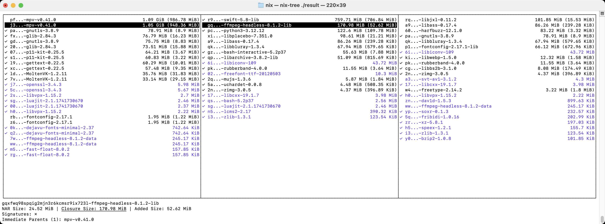

# Building IINA Dependencies with Nix

IINA, like many [open source](https://en.wikipedia.org/wiki/Open_source) applications, is built on top of code from other open source projects. The primary dependencies are:

- [mpv](https://mpv.io/) Video, audio, subtitles, filters and more
- [FFmpeg](https://ffmpeg.org/) Thumbnails, artwork, file decoding, hardware decoding, filters and more

[Libraries](https://en.wikipedia.org/wiki/Library_(computing)) built from the source code of these two projects are directly used by IINA’s source code. These projects are also built on top of code from other open source projects. A sampling of them:

- [dav1d](https://github.com/videolan/dav1d) [AV1](https://en.wikipedia.org/wiki/AV1) decoder
- [fontconfig](https://github.com/fontconfig/fontconfig) Management of fonts used by subtitles
- [libass](https://github.com/libass/libass) Subtitle rendering for the ASS/SSA (Advanced Substation Alpha/Substation Alpha) subtitle format
- [libwebp](https://libwebp.org/) Decoding WebP images and encoding screenshots in WebP format
- [Little CMS](https://www.littlecms.com/) Color management

There are many more.

To see these libraries, right click on `IINA.app` in [Finder](https://support.apple.com/guide/mac-help/organize-your-files-in-the-finder-mchlp2605/mac) and click on `Show Package Contents`. Finder will then show the directory `IINA.app/Contents`. Double click on the `Contents` directory. Finder will now show the directories and files that makeup `IINA.app`. Double click on the `Frameworks` directory. Finder will show a large number of `.dylib` files. These are [Dynamic Libraries](https://developer.apple.com/library/archive/documentation/DeveloperTools/Conceptual/DynamicLibraries/100-Articles/OverviewOfDynamicLibraries.html). Nix can be used to build these libraries.

In addition to libraries, IINA is also dependent upon [Swift Packages](https://swiftpackageregistry.com/). The `Frameworks` directory also contains a `Sparkle.framework` directory. The files in `Sparkle.framework` belong to the Swift [Sparkle Package](https://swiftpackageregistry.com/sparkle-project/Sparkle). [Sparkle](https://sparkle-project.org/) is used to upgrade IINA. Dependencies upon Swift packages are managed in IINA’s Xcode project and are not related to building libraries using Nix.

## No Need to Build Libraries

Developers looking to build IINA **do not need to build these libraries**. Libraries appropriate for the current development version of IINA can be downloaded from IINA’s servers using the script `other/download_libs.sh`. The expectation is that developers should not need to build IINA’s dependencies unless they are:

- Fixing a defect whose root causes is in one of the libraries
- Adding a feature that depends upon functionality missing from the libraries
- Upgrading to newer versions of the libraries

## Why IINA Builds Libraries

Many open source projects only provide source code, they do not provide binary packages. Several [software package management systems](https://en.wikipedia.org/wiki/List_of_software_package_management_systems) provide pre-built [binary packages](https://en.wikipedia.org/wiki/List_of_software_package_management_systems#Binary_packages). This section explains why IINA is unable to use these pre-built binaries.

### Support for Old Versions of macOS

IINA recognizes that some users are forced to run ancient versions of macOS. A common reason is the need to continue to run [abandonware](https://en.wikipedia.org/wiki/Abandonware) that might malfunction under a newer version of macOS. The cost of Apple hardware also compels users to continue to use old Macs for as long as possible. For this reason IINA tries hard to support old versions of macOS.

For IINA 1.5.0 the minimum supported macOS versions will be:

- [macOS Monterey](https://en.wikipedia.org/wiki/MacOS_Monterey) (12) For Macs with an Apple Silicon chip
- [macOS Big Sur](https://en.wikipedia.org/wiki/MacOS_Big_Sur) (11.3) For Macs with an Intel chip

IINA _must_ build _all_ of the libraries it is dependent upon configured to support these old versions of macOS as the minimum deployment target.

### Apple’s macOS Support Policy

At this time the net has not been able to locate an official Apple statement on this. The table [macOS versions supported by Apple](https://endoflife.date/macos) (non-Apple site) reflects what net has _deduced_ is Apple's support policy based on Apple's behavior. _However_ that table should probably show the two previous versions of macOS in yellow, not green, to reflect that Apple is usually only providing security updates.

This causes some open source projects to not provide support for macOS versions older than the latest 3 releases. This also causes package management systems to only provide pre-built binaries for the latest 3 macOS releases.

### Minimizing Number of Libraries

The greater the number of libraries IINA is dependent upon the greater the likelihood of encountering a library that fails to build for the old version of macOS IINA supports. When building libraries IINA can configure the builds of complex projects such as [FFmpeg](https://ffmpeg.org/) to only build features IINA uses. This can eliminate the need to build additional libraries normally needed by those projects when all supported features are enabled, thus reducing the total number of libraries that have to be buildable and functional under the old version of macOS.

## Building Dependencies Using Nix

This section covers how to build the libraries IINA requires using the [Nix Package Manager](https://en.wikipedia.org/wiki/Nix_(package_manager)).

> [!IMPORTANT]
> The Nix build **must** be run on a Mac with an Apple Silicon chip.

### Install Required Tools

To be able to run the Nix build several build tools must first be installed.

#### Determinate Nix

IINA uses [Determinate Nix](https://determinate.systems/nix/). To install this tool use the [Determinate Nix Installer](https://github.com/DeterminateSystems/nix-installer). Follow the instructions on that page.

> [!IMPORTANT]
> Be aware this is a significant installation. To perform store operations on behalf of non-root clients Determinate Nix installs a [daemon](https://manual.determinate.systems/command-ref/new-cli/nix3-daemon.html) that runs as root. The installation will require granting significant privileges.
>
> That said, Determinate Nix also provides the ability to easily perform a clean uninstall. To do this on an installed system, run via a terminal: `/nix/nix-installer uninstall`, and enter the admin password if prompted.

#### NASM

The build expects that you have installed [NASM](https://www.nasm.us/) using [brew](https://formulae.brew.sh/formula/nasm). Install [Homebrew](https://brew.sh/) and then run:

```shell-script
brew install nasm
```

#### Xcode

Make sure you are using the [latest public version of Xcode](https://itunes.apple.com/us/app/xcode/id497799835). IINA may build with another version but this is not guaranteed.

### Run the Build Script

> [!NOTE]
> The first time the Nix build is run it will take a long time. Portions of the build are done in parallel and will use all of the cores available on the Mac. If using a laptop it is desirable to run the build when connected to an electrical outlet.

To run the Nix build, execute the `build_deps.sh` script from IINA’s cloned repository:

```shell-script
./other/nix/build_deps.sh
```

The build produces [universal binaries](https://developer.apple.com/documentation/apple-silicon/building-a-universal-macos-binary).

The script copies the generated libraries into `devs/lib` and headers for FFmpeg and mpv libraries into `devs/include/…`. IINA sources reference header files, such as `deps/include/mpv/client.h`, because IINA code makes direct calls into these project's libraries. For this reason the header files are checked into IINA's git repository. Unless `flake.nix` has been modified to build a different version of FFmpeg or mpv the header files should match and `git status` should not show any changes to the header files.

> [!IMPORTANT]
> IINA **MUST** be built with headers that match the version of FFmpeg and mpv being used. If built with the wrong headers, IINA may _seem_ to work, but the FFmpeg project is known to change headers in ways that can cause IINA to malfunction or crash. IINA features that directly use FFmpeg libraries, such as OSC thumbnails, are more likely to exhibit problems.

The Nix build creates a `result` directory under the `other/nix` directory. In the `result` directory you will find the header files as well as an `IINA.app`. The Nix build generates an `IINA.app` to confirm IINA can be built with the generated libraries and associated header files. The creation of these files is an intermediate step in the build. The final result of the Nix build is the libraries and header files that have been copied to directories under `deps` for use when building IINA using Xcode.

## Upgrading Dependencies

This section discusses what is involved in changing the Nix build to generate the libraries from newer versions of their associated projects.

The Nix build is controlled by the file `other/nix/flake.nix`. Changing the build requires editing this file.

### Impact of Upgrading Nix Packages

One way to upgrade the versions of IINA’s dependencies would be to upgrade the version of [Nix Packages](https://search.nixos.org/packages) used in the build from Nixpkgs 25.05, which is currently being used. However newer versions of Nix Packages do not meet IINA’s requirements for supporting old versions of macOS and Intel based Macs.

From the [Nixpkgs 25.05](https://nixos.org/manual/nixpkgs/stable/release-notes#sec-nixpkgs-release-25.05) release notes:
> Future Nixpkgs releases will only support [macOS versions supported by Apple](https://endoflife.date/macos); this means that Nixpkgs 25.11 will require macOS Sonoma 14 or newer.

From the [Nixpkgs 26.05](https://nixos.org/manual/nixpkgs/stable/release-notes#sec-nixpkgs-release-26.05) release notes:
> **This will be the last release of Nixpkgs to support x86_64-darwin.**

So the approach taken is use [overrideAttrs](https://nixos.org/manual/nixpkgs/stable/#sec-pkg-overrideAttrs) to upgrade packages from their Nixpkgs 25.05 versions.

### Strategy for Upgrading a Package

Start by searching the current version of [Nix Packages](https://search.nixos.org/packages) for the package in question. In the search results find the correct package and click on `Source`. Usually this will open the `package.nix` file for the package. Scan the source looking for how the package fetches the source files. Nixpkgs has many different [fetchers](https://nixos.org/manual/nixpkgs/stable/#chap-pkgs-fetchers). If IINA’s `flake.nix` file is already overriding the Nixpkgs 25.05 version of the package then all you will have to do is update that entry to fetch the new version. For many packages this is sufficient.

This example shows the [freetype](https://github.com/NixOS/nixpkgs/blob/nixos-26.05/pkgs/by-name/fr/freetype/package.nix) package being overridden:

```Nix
# Upgrade to the version supplied by nixpkgs 26.05.
freetype = pkgs.freetype.overrideAttrs (
  finalAttrs: previousAttrs: {
    version = "2.14.2";
    src = pkgs.fetchurl {
      url = "mirror://savannah/freetype/freetype-${finalAttrs.version}.tar.xz";
      sha256 = "sha256-S2Lcq0ySChqGA2mTMiGBQ2LmmeJvVXklFtZx5v9VteE=";
    };
  }
);
```

Packages with more complex builds may require additional changes. Compare the `package.nix` in Nixpkgs 25.05 to the current version. Determine if changes in the newer version are applicable to IINA.

This example is from the override for the [ffmpeg](https://github.com/NixOS/nixpkgs/blob/nixos-26.05/pkgs/development/libraries/ffmpeg/generic.nix) package. As the comment indicates the newer version of FFmpeg removed a build [configure](https://en.wikipedia.org/wiki/Configure_script) option that is being applied in Nixpkgs 25.05. The override must remove that option:

```Nix
# The postproc configure flag was removed in FFmpeg 8.
configureFlags = builtins.filter (x: x != "--enable-postproc") old.configureFlags;
```

#### Patches

Some Nix packages apply source patches. If coded correctly the patches should only be applied to the applicable versions of the package. When comparing the old package to the new package look to see if there are new patches that should be applied when upgrading the version.

In recent releases IINA has had to apply patches to fix regressions in mpv. This example shows the [mpv-unwrapped](https://github.com/NixOS/nixpkgs/blob/nixos-26.05/pkgs/by-name/mp/mpv-unwrapped/package.nix) package being patched. The code follows Nix best practices and only applies the patch to the mpv versions for which it is applicable:

```Nix
patches =
  [ ]
  # If needed include the fix for IINA issue #5956, the mpv regression described in mpv
  # issue #17436 and fixed in mpv PR #17448. The fix is expected to be included in
  # mpv 0.42.0.
  ++
    pkgs.lib.optionals
      (
        pkgs.lib.versionAtLeast finalAttrs.version "v0.40.0"
        && pkgs.lib.versionOlder finalAttrs.version "v0.42.0"
      )
      [
        (pkgs.fetchpatch2 {
          url = "https://github.com/mpv-player/mpv/pull/17448.patch";
          hash = "sha256-kXnlu8SJ/GEnFljnXK4ri6CrgDBXvOTjnQo3jdPAbSA=";
        })
      ];
```

#### Changes to Library Filename

Upgrading a package may change the library's filename. When this happens the Nix build will fail unless the Xcode project is updated to expect the new filename. The old filename must be removed from the `Frameworks` group in the sidebar and the new filename added. The new filename must then be added to the `Copy Dylibs` phase under `Build Phases` for the `iina` target in the Xcode project.

Similar changes are required when adding a new library.

#### Building from a Commit

To build a package from the latest commit merely adjust the fetcher to pull the latest commit. For example the `fetchFromGitHub` configuration below fetches the mpv sources as of commit https://github.com/mpv-player/mpv/commit/70894ae0390cf20edac0e68de72ab26725520416. Since the correct hash to use is unknown zeros are used initially:

```Nix
src = pkgs.fetchFromGitHub {
  owner = "mpv-player";
  repo = "mpv";
  rev = "70894ae";
  hash = "sha256-0000000000000000000000000000000000000000000=";
};
```

This causes the build to fail with an error:

```text
error: hash mismatch in fixed-output derivation '/nix/store/8zf0j8f0fvmmxzr8jyglai42d1qaf37l-source.drv':
         specified: sha256-0000000000000000000000000000000000000000000=
            got:    sha256-nQvBVXLFnd9W6BoW7OVLr/PnmJxNT0TRQpEh38RDUy4=
error: Cannot build '/nix/store/k9xja7zwybski57i4dv250wgjpnk1qqx-mpv-v0.41.0.drv'.
       Reason: 1 dependency failed.
```

The configuration can now be updated with the hash value shown for `got`.

#### Upgrading Build Tools

As a part of supporting reproducible builds, Nix builds use internal tools by default. Upgrading packages might require upgrading build tools. For example, FFmpeg 8 requires a newer version of [NASM](https://www.nasm.us/) than supplied by Nixpkgs 25.05.

One way to upgrade build tools is to examine the tool in the latest Nixpkgs and add an override that uses updated sources, similar to upgrading packages used by IINA. Adding an override based on the [nasm package ](https://github.com/NixOS/nixpkgs/blob/nixos-26.05/pkgs/by-name/na/nasm/package.nix) in Nixpkgs 26.05 solves the FFmpeg build failure:

```Nix
nasm = pkgs.nasm.overrideAttrs (finalAttrs: {
  version = "3.01";
  src = pkgs.fetchurl {
    url = "https://www.nasm.us/pub/nasm/releasebuilds/3.01/nasm-3.01.tar.xz";
    hash = "sha256-tzJMvobnZ7ZfJvRn7YsSrYDhJOPMuJB2hVyY5Dqe3dQ=";
  };
});
```

_However_ this is not the preferred approach as it increases the size of the Nix build and requires that new versions of build tools be buildable for the old versions of macOS that IINA supports. So instead `flake.nix` is configured to use the version of [NASM](https://www.nasm.us/) installed on the Mac running the build:

```Nix
nasm = pkgs.runCommand "system-nasm" { } ''
  mkdir -p "$out/bin"
  ln -sf /opt/homebrew/bin/nasm "$out/bin/nasm"
'';
```

This is the approach that should be used for other build tools if they need to be upgraded in the future.

### Run the Nix Formatter

After editing `flake.nix` run the [nix fmt](https://manual.determinate.systems/command-ref/new-cli/nix3-fmt) command to reformat the `flake.nix` in the standard style:

```shell-script
nix fmt
```

### Building After Changing the Flake

When making changes to `flake.nix` you may want to add the `--debug` option when executing the `build_deps.sh` script:

```shell-script
./build_deps.sh --debug
```

This option will cause Nix to retain the build directory if the build fails. The build output will contain a message giving the directory:

```text
note: keeping build directory "/nix/var/nix/builds/nix-81910-19126116"
```

Inspecting the contents of the build directory may provide a clue to the nature of the failure.

### Checking for Multiple Versions

When upgrading a package that has not been upgraded before it is important to find all the packages that reference the package and configure them to use the upgraded package and not the one supplied by Nixpkgs. To check if any reference were missed run the [nix path-info](https://manual.determinate.systems/command-ref/new-cli/nix3-path-info.html) command in the `other/nix` directory after running the updated Nix build:

```shell-script
nix path-info --recursive ./result | sort -t- -k2,2
```

This example shows what it looks like when a package was not configured to use the updated version:

```text
…
/nix/store/kvpgif6d4lvn9xph7m8hvwkfd47vz7fz-freetype-2.14.2
/nix/store/q95y7m0ypswcgdfar9xi9vihwbxmcb45-freetype-2.13.3
/nix/store/s59f74npbq9kadh992aaq9qc1ggf3yhx-freetype-2.13.3
/nix/store/w4bq4gq260zdszk4b288rm4prdhh07lj-freetype-2.14.2
…
```

The [nix why-depends](https://manual.determinate.systems/command-ref/new-cli/nix3-why-depends) command can then be used to identify the package that is referencing the old version.

> [!NOTE]
> Packages will always appear at least twice, with one entry representing the result of building for `aarch64-darwin` and the other building for `x86_64-darwin`.

### Browsing Dependencies

To be able to interactively browse Nix dependency graphs, install [nix-tree](https://github.com/utdemir/nix-tree) by running this command:

```shell-script
nix-env --install nix-tree
```

Then in the `other/nix` directory run `nix-tree` on the result of the Nix build:

```shell-script
nix-tree ./result
```

The dependency tree can then be traversed using the keyboard arrow keys:


